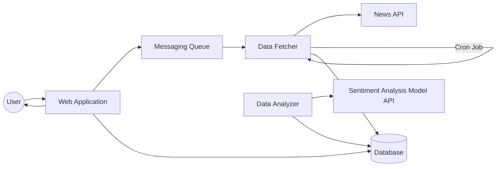
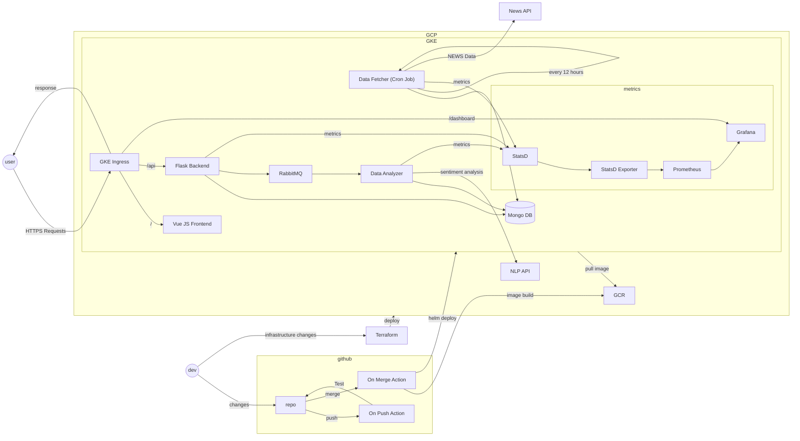

# Folio Feed
A web application that can be used to track the news regarding the stocks in a portfolio and their current trend.

This application collects the news regarding the stocks listed in user's portfolio from various sources and 
using a sentiment analysis model, we rate the news as positive, negative or neutral.

## Components
- Web Application
- Data Fetcher
- Data Analyzer

## Tech Stack

- **Backend**: Python, Flask
- **Testing**: Pytest
- **Frontend**: HTML, CSS, JS, Vue.js, Nuxt.js
- **Database**: MongoDB
- **Message Broker**: RabbitMQ
- **Deployment**: Docker, Kubernetes, Helm, Terraform, Google Cloud Platform
- **CI/CD**: Git Actions
- **Monitoring**: Prometheus, Grafana

## Basic Architecture

## High Level Design
