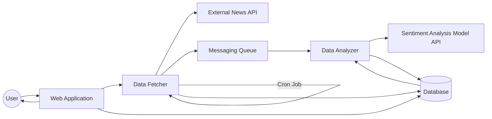
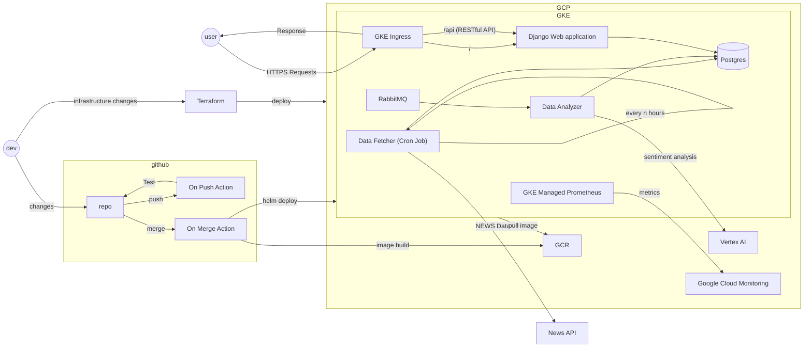

# Folio Feed: Personalized Portfolio News and Sentiment Dashboard
In today's fast-paced financial markets, keeping track of news affecting your stock portfolio can be a daunting and time-consuming task especially when your portfolio contains many individual stocks, mutual funds and cryptocurrencies. 
Even more challenging is understanding the overall sentiment of the news related to each stock, which can be pivotal in making informed investment decisions. 
Folio Feed addresses this gap by offering a one-stop solution to aggregate, analyze, and visualize news articles for the stocks in your portfolio.

Folio Feed not only aggregates news from multiple, reputable sources but also employs advanced AI sentiment analysis to categorize each article as positive, negative, or neutral. 
Through an easy-to-use dashboard, Folio Feed empowers investors to keep their fingers on the pulse of companies they have invested in, without having to sift through a myriad of news portals and financial reports.

With Folio Feed, stay updated and make smarter investment choices, even on your busiest days.

## Components
- Web Application
- Data Fetcher
- Data Analyzer

## Tech Stack

- **Backend**: Python, Django
- **Testing**: Pytest, Unittest
- **Frontend**: HTML, CSS, JS, Bootstrap
- **Database**: Postgresql
- **Message Broker**: RabbitMQ
- **Deployment**: Docker, Kubernetes (Google Kubernetes Engine), Helm, Terraform, Google Cloud Platform
- **CI/CD**: Git Actions
- **Monitoring**: Google Managed Prometheus, Google Cloud Monitoring

## Basic Architecture

## High Level Design

## Screenshots

